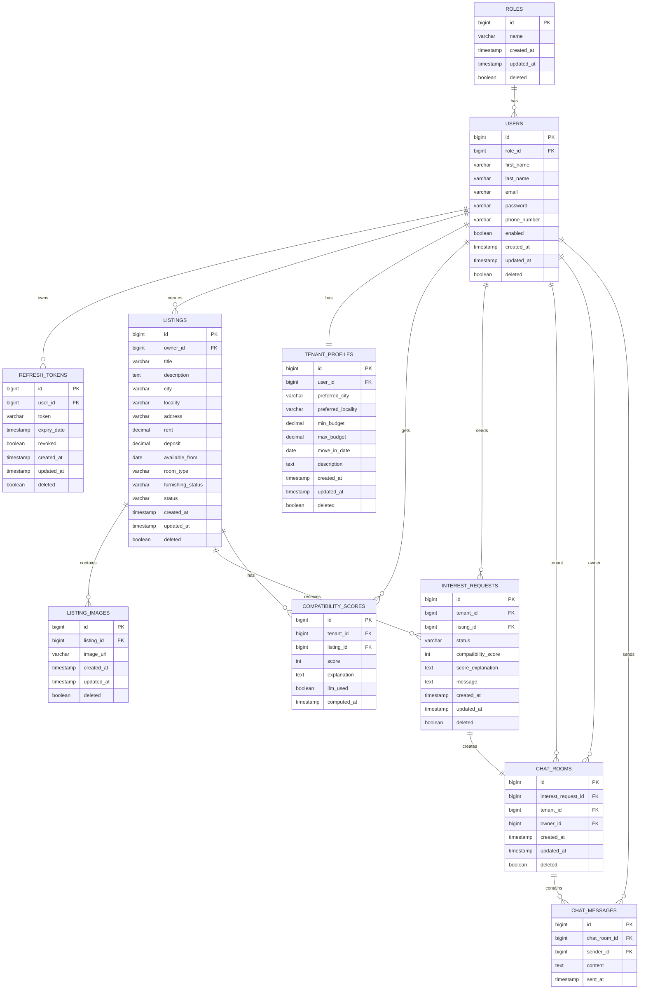

# 🏠 Rent & Flatmate Finder

> A full-stack platform connecting tenants with room owners — powered by AI-driven compatibility scoring, real-time WebSocket chat, and smart email notifications.

---

## Demo Video Link
`https://drive.google.com/drive/folders/1iJZfYfsgjKPOYzVYBMW80Vhg-wD885yb?usp=sharing`

## 🔗 Deployment Links

| Service | URL |
|---------|-----|
| **Deployed app** | `https://rentflatmate-frontend.vercel.app/` |
| **Backend API (Spring Boot)** | `https://rentflatmate-backend.onrender.com` |
| **Swagger / OpenAPI Docs** | `http://13.234.48.249:3306:8080/swagger-ui.html` |
| **Alternative** | `https://rentflatmatefinder.onrender.com/`
| **MySQL DB Host (AWS EC2)** | `13.234.48.249:3306` |

---

## 📋 Table of Contents

1. [Project Overview](#-project-overview)
2. [Tech Stack](#-tech-stack)
3. [Database Schema — MySQL on AWS EC2](#-database-schema--mysql-on-aws-ec2)
4. [Environment Variables — .env Reference](#-environment-variables--env-reference)
5. [Setup & Installation Guide](#-setup--installation-guide)
6. [REST API Documentation](#-rest-api-documentation)
7. [WebSocket API](#-websocket-api)
8. [LLM Prompt & Example I/O](#-llm-prompt--example-io)
9. [System Design Write-up](#-system-design-write-up)


---

## Note 
- **If you wish to login as admin :**
- ADMIN_EMAIL=admin@rentflatmatefinder.com
- ADMIN_PASSWORD=Admin123!
- ADMIN_FIRST_NAME=Admin
- ADMIN_LAST_NAME=User

---
## 🧩 Project Overview

**Rent & Flatmate Finder** is a two-sided marketplace where:

- **Owners** post furnished/unfurnished room listings with location, rent, and deposit details.
- **Tenants** create a preference profile (city, budget, move-in date) and browse listings.
- An **AI compatibility engine** (OpenAI GPT-4o-mini with rule-based fallback) scores each tenant–listing pair from 0–100.
- Tenants send **interest requests** to owners, who can accept or decline.
- On acceptance, a **real-time WebSocket chat room** opens between the two parties.
- Every key action triggers **HTML email notifications** via Gmail SMTP.
- An **Admin panel** manages all users and listings.

---

## 🛠 Tech Stack

| Layer | Technology |
|-------|------------|
| **Backend** | Spring Boot 3.3.5 · Java 21 |
| **Frontend** | Angular 18 |
| **Database** | MySQL 8 on AWS EC2 |
| **ORM** | Spring Data JPA / Hibernate (ddl-auto: update) |
| **Auth** | JWT — Access + Refresh tokens (`jjwt 0.12.7`) |
| **Real-time Chat** | Spring WebSocket — STOMP over SockJS |
| **AI / LLM** | OpenAI `gpt-4o-mini` (REST API) |
| **Email** | Spring Mail + Gmail SMTP (async `@Async`) |
| **File Storage** | Local filesystem `/uploads` served as static resource |
| **API Docs** | SpringDoc OpenAPI 2.6.0 — Swagger UI |
| **Mapping** | MapStruct 1.6.3 |
| **Utilities** | Lombok, Apache Commons Lang 3 |

---

## 🗄 Database Schema — MySQL on AWS EC2

> **Host:** `13.234.48.249:3306`
> **Database:** `rent_flatmate_finder`
> **User:** `rentuser`
> All tables inherit `id`, `created_at`, `updated_at`, `deleted` from `BaseEntity` unless noted.

---

### Entity Relationship Overview


---

### Table: `roles`

```sql
CREATE TABLE roles (
    id          BIGINT      NOT NULL AUTO_INCREMENT,
    name        VARCHAR(20) NOT NULL UNIQUE,   -- ADMIN | OWNER | TENANT
    created_at  DATETIME(6) NOT NULL,
    updated_at  DATETIME(6),
    deleted     TINYINT(1)  NOT NULL DEFAULT 0,
    PRIMARY KEY (id)
);
```

---

### Table: `users`

```sql
CREATE TABLE users (
    id           BIGINT       NOT NULL AUTO_INCREMENT,
    first_name   VARCHAR(50)  NOT NULL,
    last_name    VARCHAR(50)  NOT NULL,
    email        VARCHAR(255) NOT NULL UNIQUE,
    password     VARCHAR(255) NOT NULL,         -- BCrypt hashed
    phone_number VARCHAR(15),
    enabled      TINYINT(1)   NOT NULL DEFAULT 1,
    role_id      BIGINT       NOT NULL,
    created_at   DATETIME(6)  NOT NULL,
    updated_at   DATETIME(6),
    deleted      TINYINT(1)   NOT NULL DEFAULT 0,
    PRIMARY KEY (id),
    CONSTRAINT fk_users_role FOREIGN KEY (role_id) REFERENCES roles(id)
);
```

---

### Table: `refresh_tokens`

```sql
CREATE TABLE refresh_tokens (
    id          BIGINT       NOT NULL AUTO_INCREMENT,
    token       VARCHAR(500) NOT NULL UNIQUE,
    expiry_date DATETIME(6)  NOT NULL,
    revoked     TINYINT(1)   NOT NULL DEFAULT 0,
    user_id     BIGINT       NOT NULL,
    created_at  DATETIME(6)  NOT NULL,
    updated_at  DATETIME(6),
    deleted     TINYINT(1)   NOT NULL DEFAULT 0,
    PRIMARY KEY (id),
    CONSTRAINT fk_refresh_token_user FOREIGN KEY (user_id) REFERENCES users(id)
);
```

---

### Table: `listings`

```sql
CREATE TABLE listings (
    id                BIGINT        NOT NULL AUTO_INCREMENT,
    title             VARCHAR(255)  NOT NULL,
    description       VARCHAR(2000),
    city              VARCHAR(255)  NOT NULL,
    locality          VARCHAR(255)  NOT NULL,
    address           VARCHAR(255)  NOT NULL,
    rent              DECIMAL(19,2) NOT NULL,
    deposit           DECIMAL(19,2) NOT NULL,
    available_from    DATE          NOT NULL,
    room_type         VARCHAR(50)   NOT NULL,   -- SINGLE | SHARED | STUDIO | ENTIRE_FLAT
    furnishing_status VARCHAR(50)   NOT NULL,   -- FURNISHED | SEMI_FURNISHED | UNFURNISHED
    status            VARCHAR(50)   NOT NULL,   -- ACTIVE | FILLED | INACTIVE
    owner_id          BIGINT        NOT NULL,
    created_at        DATETIME(6)   NOT NULL,
    updated_at        DATETIME(6),
    deleted           TINYINT(1)    NOT NULL DEFAULT 0,
    PRIMARY KEY (id),
    CONSTRAINT fk_listing_owner FOREIGN KEY (owner_id) REFERENCES users(id)
);
```

---

### Table: `listing_images`

```sql
CREATE TABLE listing_images (
    id         BIGINT       NOT NULL AUTO_INCREMENT,
    image_url  VARCHAR(255) NOT NULL,
    listing_id BIGINT       NOT NULL,
    created_at DATETIME(6)  NOT NULL,
    updated_at DATETIME(6),
    deleted    TINYINT(1)   NOT NULL DEFAULT 0,
    PRIMARY KEY (id),
    CONSTRAINT fk_image_listing FOREIGN KEY (listing_id) REFERENCES listings(id)
);
```

---

### Table: `tenant_profiles`

```sql
CREATE TABLE tenant_profiles (
    id                 BIGINT        NOT NULL AUTO_INCREMENT,
    user_id            BIGINT        NOT NULL UNIQUE,
    preferred_city     VARCHAR(255)  NOT NULL,
    preferred_locality VARCHAR(255),
    min_budget         DECIMAL(19,2) NOT NULL,
    max_budget         DECIMAL(19,2) NOT NULL,
    move_in_date       DATE          NOT NULL,
    description        VARCHAR(1000),
    created_at         DATETIME(6)   NOT NULL,
    updated_at         DATETIME(6),
    deleted            TINYINT(1)    NOT NULL DEFAULT 0,
    PRIMARY KEY (id),
    CONSTRAINT fk_profile_user FOREIGN KEY (user_id) REFERENCES users(id)
);
```

---

### Table: `interest_requests`

```sql
CREATE TABLE interest_requests (
    id                  BIGINT       NOT NULL AUTO_INCREMENT,
    tenant_id           BIGINT       NOT NULL,
    listing_id          BIGINT       NOT NULL,
    status              VARCHAR(30)  NOT NULL,  -- PENDING | ACCEPTED | DECLINED
    compatibility_score INT,
    score_explanation   VARCHAR(1000),
    message             VARCHAR(500),
    created_at          DATETIME(6)  NOT NULL,
    updated_at          DATETIME(6),
    deleted             TINYINT(1)   NOT NULL DEFAULT 0,
    PRIMARY KEY (id),
    CONSTRAINT fk_interest_tenant  FOREIGN KEY (tenant_id)  REFERENCES users(id),
    CONSTRAINT fk_interest_listing FOREIGN KEY (listing_id) REFERENCES listings(id)
);
```

---

### Table: `chat_rooms`

```sql
CREATE TABLE chat_rooms (
    id                  BIGINT     NOT NULL AUTO_INCREMENT,
    interest_request_id BIGINT     NOT NULL UNIQUE,
    tenant_id           BIGINT     NOT NULL,
    owner_id            BIGINT     NOT NULL,
    created_at          DATETIME(6) NOT NULL,
    updated_at          DATETIME(6),
    deleted             TINYINT(1)  NOT NULL DEFAULT 0,
    PRIMARY KEY (id),
    CONSTRAINT fk_room_interest FOREIGN KEY (interest_request_id) REFERENCES interest_requests(id),
    CONSTRAINT fk_room_tenant   FOREIGN KEY (tenant_id)           REFERENCES users(id),
    CONSTRAINT fk_room_owner    FOREIGN KEY (owner_id)            REFERENCES users(id)
);
```

---

### Table: `chat_messages`

```sql
CREATE TABLE chat_messages (
    id           BIGINT        NOT NULL AUTO_INCREMENT,
    chat_room_id BIGINT        NOT NULL,
    sender_id    BIGINT        NOT NULL,
    content      VARCHAR(2000) NOT NULL,
    sent_at      DATETIME(6)   NOT NULL,
    PRIMARY KEY (id),
    CONSTRAINT fk_msg_room   FOREIGN KEY (chat_room_id) REFERENCES chat_rooms(id),
    CONSTRAINT fk_msg_sender FOREIGN KEY (sender_id)    REFERENCES users(id)
);
```

---

### Table: `compatibility_scores`

```sql
CREATE TABLE compatibility_scores (
    id          BIGINT        NOT NULL AUTO_INCREMENT,
    tenant_id   BIGINT        NOT NULL,
    listing_id  BIGINT        NOT NULL,
    score       INT           NOT NULL,         -- 0 to 100
    explanation VARCHAR(1000),
    llm_used    TINYINT(1)    NOT NULL,         -- 1 = GPT, 0 = rule-based
    computed_at DATETIME(6)   NOT NULL,
    deleted     TINYINT(1)    NOT NULL DEFAULT 0,
    PRIMARY KEY (id),
    UNIQUE KEY uq_score_tenant_listing (tenant_id, listing_id),
    CONSTRAINT fk_score_tenant  FOREIGN KEY (tenant_id)  REFERENCES users(id),
    CONSTRAINT fk_score_listing FOREIGN KEY (listing_id) REFERENCES listings(id)
);
```

---

### Enum Values (stored as VARCHAR)

| Enum | Allowed Values |
|------|---------------|
| `RoleName` | `ADMIN` · `OWNER` · `TENANT` |
| `RoomType` | `SINGLE` · `SHARED` · `STUDIO` · `ENTIRE_FLAT` |
| `FurnishingStatus` | `FURNISHED` · `SEMI_FURNISHED` · `UNFURNISHED` |
| `ListingStatus` | `ACTIVE` · `FILLED` · `INACTIVE` |
| `InterestStatus` | `PENDING` · `ACCEPTED` · `DECLINED` |

---

## 🔑 Environment Variables — .env Reference


```bash
# ============================================================
#   Rent & Flatmate Finder — .env.example
#   cp .env.example .env   then fill in real values
# ============================================================

# ── Database (MySQL on AWS EC2) ──────────────────────────────
DB_HOST=13.234.48.249           # EC2 public IP or RDS endpoint
DB_PORT=3306
DB_NAME=rent_flatmate_finder
DB_USERNAME=rentuser
DB_PASSWORD=your_db_password_here

# application.yml resolves to:
# jdbc:mysql://${DB_HOST}:${DB_PORT}/${DB_NAME}

# ── JWT Authentication ────────────────────────────────────────
JWT_SECRET=your_256bit_secret_key_minimum_32_chars_here
JWT_ACCESS_TOKEN_EXPIRATION=900000       # 15 min (ms)
JWT_REFRESH_TOKEN_EXPIRATION=604800000   # 7 days (ms)

# ── OpenAI — LLM Compatibility Scoring ───────────────────────
# Get key: https://platform.openai.com/api-keys
OPENAI_API_KEY=sk-your-openai-api-key-here
OPENAI_API_URL=https://api.openai.com/v1/chat/completions
OPENAI_MODEL=gpt-4o-mini

# ── Mail — Gmail SMTP ─────────────────────────────────────────
# App password (not your Gmail login):
# https://myaccount.google.com/apppasswords
MAIL_USERNAME=your-email@gmail.com
MAIL_PASSWORD=your-16-char-app-password

# ── Application ───────────────────────────────────────────────
FRONTEND_URL=http://localhost:4200   # Change to deployed frontend URL
SERVER_PORT=8080

# ── Admin Seed User (created on first boot) ───────────────────
ADMIN_EMAIL=admin@rentflatmatefinder.com
ADMIN_PASSWORD=Admin123!
ADMIN_FIRST_NAME=Admin
ADMIN_LAST_NAME=User
```

### application.yml mapping

Every variable maps 1-to-1 into `application.yml`:

| .env Variable | application.yml Key |
|--------------|---------------------|
| `DB_HOST` | `spring.datasource.url` (host part) |
| `DB_PORT` | `spring.datasource.url` (port part) |
| `DB_NAME` | `spring.datasource.url` (db name part) |
| `DB_USERNAME` | `spring.datasource.username` |
| `DB_PASSWORD` | `spring.datasource.password` |
| `JWT_SECRET` | `jwt.secret` |
| `JWT_ACCESS_TOKEN_EXPIRATION` | `jwt.access-token-expiration` |
| `JWT_REFRESH_TOKEN_EXPIRATION` | `jwt.refresh-token-expiration` |
| `OPENAI_API_KEY` | `openai.api-key` |
| `OPENAI_API_URL` | `openai.api-url` |
| `OPENAI_MODEL` | `openai.model` |
| `MAIL_USERNAME` | `spring.mail.username` |
| `MAIL_PASSWORD` | `spring.mail.password` |
| `FRONTEND_URL` | `app.frontend-url` |
| `SERVER_PORT` | `server.port` |
| `ADMIN_EMAIL` | `app.admin.email` |
| `ADMIN_PASSWORD` | `app.admin.password` |
| `ADMIN_FIRST_NAME` | `app.admin.first-name` |
| `ADMIN_LAST_NAME` | `app.admin.last-name` |

---

## ⚙️ Setup & Installation Guide

### Prerequisites

| Tool | Version |
|------|---------|
| Java | 21+ |
| Maven | 3.9+ |
| Node.js | 18+ |
| Angular CLI | 17+ |
| MySQL | 8.0+ |

---

### 1 · Clone the Repository

```bash
git clone https://github.com/AshishShirsath/Unthinkable_Solutions
cd rent-flatmate-finder
```

### 2 · Set Up Environment

```bash
# Root of the project
cp .env.example .env
# Open .env and fill in your DB password, SMTP, JWT secret, OpenAI key available in the zip file
```

### 3 · Local Database

```sql
CREATE DATABASE rent_flatmate_finder;
CREATE USER 'rentuser'@'localhost' IDENTIFIED BY 'your_db_password_here';
GRANT ALL PRIVILEGES ON rent_flatmate_finder.* TO 'rentuser'@'localhost';
FLUSH PRIVILEGES;
```

### 4 · Start the Backend

```bash
cd rentflatmatefinder

# Load .env into shell, then run
export $(grep -v '^#' ../.env | xargs)
./mvnw spring-boot:run
```

Backend → `http://localhost:8080`
Swagger → `http://localhost:8080/swagger-ui.html`

### 5 · Start the Frontend

```bash
cd rentflatmatefinder-ui
npm install
ng serve         # http://localhost:4200
```

### 6 · AWS EC2 Production Deployment

```bash
# On your EC2 instance
sudo yum install java-21-amazon-corretto -y

# Upload the JAR
scp -i your-key.pem \
  rentflatmatefinder/target/rentflatmatefinder-*.jar \
  ec2-user@<EC2_IP>:/home/ec2-user/app.jar

# Upload your .env
scp -i your-key.pem .env ec2-user@<EC2_IP>:/home/ec2-user/.env

# SSH in and run
ssh -i your-key.pem ec2-user@<EC2_IP>
export $(grep -v '^#' ~/.env | xargs)
java -jar ~/app.jar &
```

---

## 📡 REST API Documentation

**Base URL:** `http://localhost:8080/api/v1`
**Auth:** `Authorization: Bearer <access_token>`

---

### Authentication `/api/v1/auth`

| Method | Endpoint | Auth | Description |
|--------|----------|------|-------------|
| `POST` | `/register` | — | Register new user (OWNER or TENANT) |
| `POST` | `/login` | — | Login, receive access + refresh tokens |
| `POST` | `/logout` | — | Revoke a refresh token |
| `POST` | `/refresh` | — | Get new access token via refresh token |

**POST `/register`**

```json
// Request
{
  "firstName": "Ashish",
  "lastName": "Shirsath",
  "email": "ashish@example.com",
  "password": "SecurePass123!",
  "phoneNumber": "9876543210",
  "role": "TENANT"
}

// Response 201
{
  "success": true,
  "message": "User registered successfully",
  "data": { "accessToken": "eyJ...", "refreshToken": "eyJ..." },
  "timestamp": "2025-07-15T06:30:00"
}
```

**POST `/login`**

```json
// Request
{ "email": "ashish@example.com", "password": "SecurePass123!" }

// Response 200
{
  "success": true,
  "message": "Login successful",
  "data": { "accessToken": "eyJ...", "refreshToken": "eyJ..." },
  "timestamp": "2025-07-15T06:30:00"
}
```

---

### Listings `/api/v1/listings`

| Method | Endpoint | Role | Description |
|--------|----------|------|-------------|
| `POST` | `/` | OWNER | Create listing |
| `GET` | `/` | Public | Browse listings (`?city=&minBudget=&maxBudget=`) |
| `GET` | `/{id}` | Public | Get listing by ID |
| `PUT` | `/{id}` | OWNER | Update listing |
| `DELETE` | `/{id}` | OWNER/ADMIN | Soft-delete listing |
| `GET` | `/my` | OWNER | Get my listings |
| `PUT` | `/{id}/fill` | OWNER | Mark listing as filled |
| `GET` | `/{id}/compatibility` | TENANT | Get AI compatibility score |

**POST `/`**

```json
// Request
{
  "title": "Cozy Studio in Koregaon Park",
  "description": "Furnished studio near FC Road. Bills included.",
  "city": "Pune",
  "locality": "Koregaon Park",
  "address": "12 Rose Garden Lane 5",
  "rent": 18000,
  "deposit": 36000,
  "availableFrom": "2025-08-01",
  "roomType": "STUDIO",
  "furnishingStatus": "FURNISHED",
  "imageUrls": ["http://localhost:8080/uploads/abc123.jpg"]
}

// Response 201
{
  "success": true,
  "message": "Listing created successfully",
  "data": { "id": 1, "title": "Cozy Studio...", "status": "ACTIVE", "..." : "..." }
}
```

---

### Tenant Profile `/api/v1/tenant-profile`

| Method | Endpoint | Role | Description |
|--------|----------|------|-------------|
| `POST` | `/` | TENANT | Create or update preference profile |
| `GET` | `/me` | TENANT | Get my profile |

```json
// POST / Request
{
  "preferredCity": "Pune",
  "preferredLocality": "Koregaon Park",
  "minBudget": 12000,
  "maxBudget": 22000,
  "moveInDate": "2025-08-15",
  "description": "Working professional, non-smoker, need quiet place."
}
```

---

### Interest Requests `/api/v1/interests`

| Method | Endpoint | Role | Description |
|--------|----------|------|-------------|
| `POST` | `/` | TENANT | Send interest on a listing |
| `GET` | `/sent` | TENANT | My sent interests |
| `GET` | `/received` | OWNER | Interests received on my listings |
| `PUT` | `/{id}/accept` | OWNER | Accept → creates chat room + email |
| `PUT` | `/{id}/decline` | OWNER | Decline → sends email |

```json
// POST / Request
{ "listingId": 1, "message": "Hi, available for visit this weekend." }

// Response 201
{
  "success": true,
  "message": "Interest sent successfully",
  "data": {
    "id": 5,
    "listingId": 1,
    "listingTitle": "Cozy Studio in Koregaon Park",
    "status": "PENDING",
    "compatibilityScore": 87,
    "scoreExplanation": "City and locality match. Rent within budget.",
    "message": "Hi, available for visit this weekend.",
    "createdAt": "2025-07-15T06:35:00"
  }
}
```

---

### Compatibility `/api/v1/listings/{id}/compatibility`

```json
// GET /{id}/compatibility   (TENANT role)
// Response 200
{
  "success": true,
  "message": "Compatibility score computed",
  "data": {
    "listingId": 1,
    "score": 87,
    "explanation": "City and locality match. Rent is within budget range.",
    "llmUsed": true
  }
}
```

---

### Chat `/api/v1/chat`

| Method | Endpoint | Auth | Description |
|--------|----------|------|-------------|
| `GET` | `/rooms` | JWT | List my chat rooms |
| `GET` | `/rooms/{roomId}/messages` | JWT | Full message history |
| `POST` | `/rooms/{roomId}/messages` | JWT | Send REST message |

---

### File Upload `/api/v1/files`

| Method | Endpoint | Auth | Description |
|--------|----------|------|-------------|
| `POST` | `/upload` | JWT | Upload images (`multipart/form-data`, field: `files`) |

```json
// Response 200
{
  "success": true,
  "message": "Files uploaded successfully",
  "data": [
    "http://localhost:8080/uploads/uuid1.jpg",
    "http://localhost:8080/uploads/uuid2.png"
  ]
}
```

---

### Admin `/api/v1/admin` _(ADMIN only)_

| Method | Endpoint | Description |
|--------|----------|-------------|
| `GET` | `/users` | All users |
| `GET` | `/listings` | All listings incl. deleted |
| `DELETE` | `/users/{id}` | Disable user |
| `DELETE` | `/listings/{id}` | Soft-delete listing |

---

### Health

| Method | Endpoint | Description |
|--------|----------|-------------|
| `GET` | `/api/v1/health` | Returns `{ "status": "OK" }` |

---

## 🔌 WebSocket API

| Item | Value |
|------|-------|
| **Protocol** | STOMP over SockJS |
| **Connect URL** | `ws://localhost:8080/ws` |
| **Auth** | JWT in `Authorization: Bearer <token>` header on handshake |

### Publish (Client → Server)

| Destination | Payload |
|-------------|---------|
| `/app/chat` | `{ "roomId": 3, "content": "Hello!" }` |

### Subscribe (Server → Client)

| Destination | Description |
|-------------|-------------|
| `/topic/chat/{roomId}` | Live messages for a room |

```json
// Broadcast payload
{
  "id": 42,
  "roomId": 3,
  "senderName": "Ashish Shirsath",
  "content": "Hello! Is the room still available?",
  "sentAt": "2025-07-15T06:45:00"
}
```

---

## 🤖 LLM Prompt & Example I/O

This is the **exact prompt** stored in `application.yml` under `openai.prompt` and injected into every GPT-4o-mini call via `CompatibilityService`.

### System Message

```
You are a helpful room compatibility scoring assistant.
Respond ONLY with valid JSON and nothing else.
```

### User Message Template

```
You are a helpful room compatibility scoring assistant. Respond ONLY with valid JSON and nothing else.
Given this room listing: {title: "{title}", city: "{city}", locality: "{locality}", rent: {rent}, roomType: "{roomType}", furnishing: "{furnishing}"}
And this tenant profile: {preferredCity: "{preferredCity}", preferredLocality: "{preferredLocality}", minBudget: {minBudget}, maxBudget: {maxBudget}, description: "{description}"}
Compute a compatibility score from 0 to 100 based on budget and location match and return JSON exactly like: {"score": <number>, "explanation": "<string>"}
```

> Variables `{title}`, `{city}`, `{locality}`, `{rent}`, `{roomType}`, `{furnishing}`, `{preferredCity}`, `{preferredLocality}`, `{minBudget}`, `{maxBudget}`, `{description}` are replaced at runtime using `String.replace()` in `CompatibilityService.callLlm()`.

---

### Example Input (after variable substitution)

```
You are a helpful room compatibility scoring assistant. Respond ONLY with valid JSON and nothing else.
Given this room listing: {title: "Cozy Studio in Koregaon Park", city: "Pune", locality: "Koregaon Park", rent: 18000, roomType: "STUDIO", furnishing: "FURNISHED"}
And this tenant profile: {preferredCity: "Pune", preferredLocality: "Koregaon Park", minBudget: 12000, maxBudget: 22000, description: "Working professional, non-smoker, prefer quiet area."}
Compute a compatibility score from 0 to 100 based on budget and location match and return JSON exactly like: {"score": <number>, "explanation": "<string>"}
```

### Example Output (GPT-4o-mini)

```json
{
  "score": 91,
  "explanation": "City and locality both match the tenant's preferences perfectly. The rent of 18000 falls comfortably within the budget range of 12000 to 22000. The furnished studio is ideal for a working professional seeking a ready-to-move-in space."
}
```

### OpenAI API Call Parameters

| Parameter | Value |
|-----------|-------|
| Model | `gpt-4o-mini` (from `OPENAI_MODEL` env var) |
| Temperature | `0.3` |
| Max tokens | `200` |
| Endpoint | `OPENAI_API_URL` env var |
| Auth | `Authorization: Bearer ${OPENAI_API_KEY}` |

---

### Rule-Based Fallback (when `OPENAI_API_KEY` is missing or call fails)

| Condition | Score Added |
|-----------|-------------|
| City matches `preferredCity` | **+40** |
| Locality contains `preferredLocality` | **+10** |
| Rent within `[minBudget, maxBudget]` | **+50** |
| Rent below `minBudget` | **+30** |
| Rent above `maxBudget` | Proportional penalty — up to −50 |
| No tenant profile at all | **= 50** (fixed default) |

**Fallback chain:**
```
LLM configured + profile exists   →  Call GPT-4o-mini
  └─ Exception thrown             →  Rule-based scoring (warn log)
LLM not configured + profile      →  Rule-based scoring
No profile                        →  Score = 50, prompt to complete profile
```

---

## 🏗 System Design Write-up

### Overview

Rent & Flatmate Finder is a layered monolith with event-driven side effects. The Spring Boot backend exposes a REST API and an embedded STOMP WebSocket broker. The Angular SPA communicates over HTTP and WebSocket. MySQL on AWS EC2 is the sole persistent store.

### Compatibility Scoring Design

Scoring is triggered when a tenant requests `GET /listings/{id}/compatibility` or submits an interest request. Results are cached in `compatibility_scores` (UNIQUE on `tenant_id + listing_id`), so re-requests are instant without incurring additional LLM cost. The `llm_used` boolean flag surfaces in the UI to distinguish GPT-generated explanations from rule-based ones. The rule-based engine is deterministic: 40 pts for city match, 10 for locality, up to 50 for budget fit, with a proportional penalty if rent exceeds the max budget.

### LLM Integration and Fallback

`CompatibilityService.isLlmConfigured()` guards against blank or placeholder keys. When configured, it issues a synchronous POST to OpenAI with temperature 0.3 and max 200 tokens, then strips markdown fences from the response before JSON parsing. Any exception (network, rate-limit, malformed JSON) falls back to the rule-based engine with a warning log — no request ever fails due to LLM unavailability.

### Chat Implementation

Dual-channel delivery ensures reliability. On WebSocket connect, a `ChannelInterceptor` extracts and validates the JWT, setting the authenticated `Principal`. Clients publish to `/app/chat`; the `ChatWebSocketController` persists the message via `ChatService` then broadcasts to `/topic/chat/{roomId}` via `SimpMessagingTemplate`. The REST endpoint `GET /chat/rooms/{roomId}/messages` provides history on page load before the socket subscribes — preventing race conditions. A `ChatRoom` is created exactly once when an owner accepts an interest, keyed by the unique `interest_request_id`.

### Notification Flow

All three email triggers are `@Async` — they run on Spring's task executor pool and never block the HTTP thread. **Trigger 1:** On interest submission, the listing owner receives an HTML email with tenant name, listing title, and compatibility score. **Trigger 2:** On acceptance, the tenant is notified and directed to the chat room. **Trigger 3:** On decline, the tenant receives a polite rejection email. Gmail SMTP over STARTTLS on port 587 is used; credentials are read from `MAIL_USERNAME` and `MAIL_PASSWORD` environment variables.

